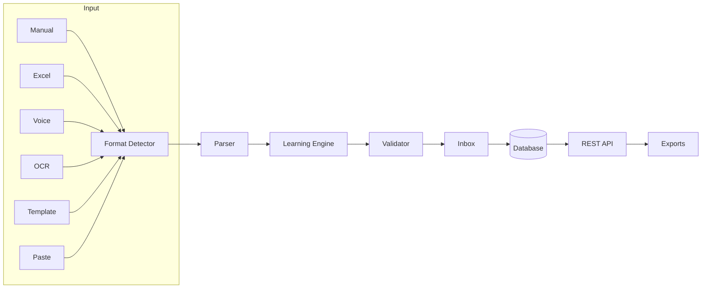

# CAI Intake

<p align="center">
  
</p>

<p align="center">
  <strong>The Universal Cutlist Engine for Cabinet & Woodworking Manufacturing</strong>
</p>

<p align="center">
  <em>Transforming Chaos into Precision</em>
</p>

<p align="center">
  <a href="#features">Features</a> •
  <a href="#quick-start">Quick Start</a> •
  <a href="#architecture">Architecture</a> •
  <a href="#api">API</a> •
  <a href="#documentation">Documentation</a> •
  <a href="#support">Support</a>
</p>

<p align="center">
  
  
  
  
  
</p>

---

## Overview

CAI Intake is an enterprise-grade SaaS platform that solves the **cutlist data chaos** problem in cabinet and woodworking manufacturing. Every workshop receives cutlists in countless formats—handwritten notes, Excel spreadsheets, PDFs, photos, and verbal instructions. This inconsistency leads to errors, wasted materials, and frustrated operators.

CAI Intake provides **6 intelligent input modes** that all converge into a single, validated canonical format ready for optimization and manufacturing.

### The Problem

```
┌─────────────────────────────────────────────────────────────────┐
│                    REAL-WORLD DATA SOURCES                      │
├─────────────────────────────────────────────────────────────────┤
│  📝 Handwritten notes from craftsmen                            │
│  📊 Excel files with inconsistent columns                       │
│  📄 PDFs from SketchCut, MaxCut, CutList Plus                   │
│  📸 Photos of paper cutlists                                    │
│  🗣️ Verbal instructions during meetings                         │
│  💬 WhatsApp messages with scattered dimensions                 │
└─────────────────────────────────────────────────────────────────┘
```

**The Cost**: 2-4 hours/day wasted on data entry, 10-20% material waste from errors.

### The Solution

```
┌─────────────────────────────────────────────────────────────────┐
│                      CAI INTAKE                                 │
├──────┬──────┬──────┬──────┬──────┬──────┬──────────────────────┤
│Manual│Excel │Voice │OCR/AI│QR    │Paste │     All modes        │
│Entry │Import│Dict. │Upload│Templ.│Parse │     unified          │
└──┬───┴──┬───┴──┬───┴──┬───┴──┬───┴──┬───┘                      │
   └──────┴──────┴──────┴──────┴──────┘                          │
                     │                                            │
                     ▼                                            │
         ┌───────────────────────┐                                │
         │   CANONICAL SCHEMA    │  ◄── Single source of truth   │
         │   (cai-cutlist/v1)    │                                │
         └───────────┬───────────┘                                │
                     │                                            │
         ┌───────────┴───────────┐                                │
         ▼                       ▼                                │
  ┌─────────────┐       ┌─────────────┐                          │
  │ Optimizers  │       │ Export      │                          │
  │ (MaxCut,etc)│       │ (PDF,CSV,.) │                          │
  └─────────────┘       └─────────────┘                          │
└─────────────────────────────────────────────────────────────────┘
```

---

## Features

### 🎯 Six Intelligent Input Modes

| Mode | Description | Accuracy | Best For |
|------|-------------|----------|----------|
| **Manual Entry** | Natural language parsing | 100% | Quick additions |
| **Excel/CSV** | Upload with column mapping | 95%+ | Spreadsheet imports |
| **Voice Dictation** | Hands-free via Web Speech | 90%+ | Mobile, shop floor |
| **Smart Upload** | AI-powered OCR (Claude + GPT) | 85%+ | PDFs, images, scans |
| **QR Templates** | Organization-branded forms | 99%+ | Standardized workflows |
| **Copy/Paste** | Smart text parsing | 85%+ | Quick transfers |

### 🧠 Self-Learning System

- **Few-Shot Learning**: AI learns from curated examples
- **Pattern Recognition**: Learns your formats automatically
- **Material Mapping**: Auto-matches materials to your library
- **Silent Auto-Training**: Corrections improve future parsing
- **Template Detection**: Recognizes SketchCut, MaxCut, CutList Plus, CAI

### 📋 Full CNC Operations

Beyond just dimensions, CAI Intake captures:
- **Edge Banding**: L1, L2, W1, W2 with material references
- **Grooves**: Dados for backs, orientation-aware
- **Drilling**: Hole patterns with coordinates and depths
- **CNC Routing**: Custom routing operations and programs

### 🏢 Enterprise Ready

- Multi-tenant organization support
- Role-based access (Owner, Admin, Manager, Operator, Viewer)
- Versioned REST API with rate limiting
- Webhook notifications
- SOC 2 compliance (in progress)
- 99.9% uptime SLA (Enterprise)

---

## Quick Start

### Prerequisites

- Node.js 20+
- PostgreSQL 15+ (or Supabase account)
- npm or yarn

### Installation

```bash
# Clone the repository
git clone https://github.com/positivesocial/CAI-Intake.git
cd CAI-Intake

# Install dependencies
npm install

# Set up environment variables
cp env.example .env
# Edit .env with your credentials

# Generate Prisma client
npm run db:generate

# Push schema to database
npm run db:push

# Start development server
npm run dev
```

Visit `http://localhost:3000` to see the application.

### Environment Variables

```env
# Database
DATABASE_URL="postgresql://..."
SUPABASE_URL="https://..."
SUPABASE_ANON_KEY="..."
SUPABASE_SERVICE_ROLE_KEY="..."

# AI Providers
ANTHROPIC_API_KEY="sk-ant-..."      # Primary - Claude 3.5/4
OPENAI_API_KEY="sk-..."              # Fallback - GPT-4o

# Python OCR Service (optional)
PYTHON_OCR_URL="http://localhost:8000"

# Email (optional)
RESEND_API_KEY="re_..."
EMAIL_FROM="CAI Intake <noreply@cai-intake.io>"

# App
NEXT_PUBLIC_APP_URL="http://localhost:3000"
```

### Demo Accounts

| Role | Email | Password | Access |
|------|-------|----------|--------|
| **Super Admin** | `super@cai-intake.io` | `SuperAdmin123!` | Platform-wide |
| **Org Admin** | `admin@acmecabinets.com` | `OrgAdmin123!` | Organization |
| **Operator** | `operator@acmecabinets.com` | `Operator123!` | Basic |

Use **Quick Demo Login** buttons on the login page.

---

## Architecture

### Tech Stack

| Layer | Technology |
|-------|------------|
| **Framework** | Next.js 16 (App Router, Turbopack) |
| **Language** | TypeScript 5 |
| **Styling** | Tailwind CSS + shadcn/ui |
| **Database** | PostgreSQL + Supabase |
| **ORM** | Prisma |
| **Validation** | Zod |
| **State** | Zustand (persisted) |
| **AI Primary** | Anthropic Claude 3.5/4 |
| **AI Fallback** | OpenAI GPT-4o |
| **OCR** | Python Tesseract + Vision |
| **Animation** | Framer Motion |

### Project Structure

```
src/
├── app/                    # Next.js App Router
│   ├── (auth)/             # Authentication (login, signup)
│   ├── (dashboard)/        # Protected dashboard
│   │   ├── cutlists/       # Cutlist management
│   │   ├── intake/         # Intake workflow
│   │   ├── library/        # Materials, operations
│   │   └── settings/       # Organization settings
│   ├── (marketing)/        # Public pages (landing, pricing)
│   ├── (platform)/         # Super admin pages
│   └── api/v1/             # Versioned REST API
├── components/
│   ├── ui/                 # shadcn/ui components
│   ├── intake/             # Intake workflow components
│   ├── parts/              # Parts table, preview
│   └── training/           # Learning system UI
├── lib/
│   ├── schema/             # Canonical Zod schemas
│   ├── parsers/            # Input parsing engines
│   ├── ai/                 # AI provider clients
│   ├── learning/           # Learning system
│   ├── exports/            # Export format generators
│   └── notifications/      # Notification system
└── types/                  # TypeScript types
```

### Data Flow



---

## API

### Base URL

```
Production: https://api.cai-intake.io/v1
Development: http://localhost:3000/api/v1
```

### Authentication

```bash
# Bearer Token (user sessions)
curl -H "Authorization: Bearer $ACCESS_TOKEN" ...

# API Key (integrations)
curl -H "X-API-Key: cai_live_xxxxx" ...
```

### Key Endpoints

| Endpoint | Method | Description |
|----------|--------|-------------|
| `/cutlists` | GET/POST | List/create cutlists |
| `/cutlists/{id}` | GET/PUT/DELETE | Manage cutlist |
| `/parse-file` | POST | Parse file with AI/OCR |
| `/parse-text` | POST | Parse text input |
| `/exports` | POST | Generate export file |
| `/materials` | GET/POST | Manage materials |
| `/operations/*` | GET/POST | Manage operations |

### Example: Parse Text

```bash
curl -X POST https://api.cai-intake.io/v1/parse-text \
  -H "Authorization: Bearer $TOKEN" \
  -H "Content-Type: application/json" \
  -d '{
    "text": "Side panel 720x560 qty 2 white board edge 2L",
    "options": {
      "units": "mm",
      "default_thickness_mm": 18
    }
  }'
```

### Response

```json
{
  "success": true,
  "parts": [
    {
      "part_id": "pt_abc123",
      "label": "Side panel",
      "size": { "L": 720, "W": 560 },
      "thickness_mm": 18,
      "qty": 2,
      "material_id": "mat_white_board",
      "ops": {
        "edging": { "edges": { "L1": { "apply": true }, "L2": { "apply": true } } }
      }
    }
  ],
  "confidence": 0.95,
  "metadata": {
    "parserMode": "pattern",
    "processingTimeMs": 45
  }
}
```

---

## Export Formats

| Format | Extension | Description |
|--------|-----------|-------------|
| **JSON** | `.json` | Native CAI format with full metadata |
| **CSV** | `.csv` | Universal spreadsheet format |
| **PDF** | `.pdf` | Printable parts list with operations |
| **MaxCut** | `.mcp` | MaxCut optimization software |
| **CutList Plus** | `.csv` | CutList Plus Pro format |
| **CutRite** | `.xml` | CutRite/Holzma format |
| **Optimik** | `.csv` | Optimik software format |

---

## Subscription Plans

| Plan | Price | Users | Cutlists/mo | Features |
|------|-------|-------|-------------|----------|
| **Free** | $0 | 1 | 5 | Basic entry, CSV export |
| **Starter** | $29/mo | 3 | 50 | Excel, Voice, Edgebanding |
| **Professional** | $79/mo | 10 | 500 | Full OCR, CNC ops, API |
| **Enterprise** | Custom | Unlimited | Unlimited | SLA, Priority support |

---

## Documentation

| Document | Description |
|----------|-------------|
| [User Guide](docs/USER_GUIDE.md) | Complete user documentation |
| [API Reference](docs/API.md) | REST API documentation |
| [OpenAPI Spec](docs/openapi.yaml) | Machine-readable API spec |
| [Deployment Guide](docs/DEPLOYMENT.md) | Self-hosting instructions |
| [Learning System](docs/LEARNING_SYSTEM.md) | How the AI learns |
| [White Paper](docs/WHITEPAPER.md) | Technical overview for stakeholders |
| [Business Plan](docs/BUSINESS_PLAN.md) | Business strategy |

---

## Development

### Commands

```bash
npm run dev          # Start dev server (Turbopack)
npm run build        # Production build
npm run start        # Start production server
npm run lint         # Run ESLint
npm run db:generate  # Generate Prisma client
npm run db:push      # Push schema to database
npm run db:migrate   # Run migrations
npm run db:studio    # Open Prisma Studio
```

### Git Workflow

- **Conventional Commits**: `feat:`, `fix:`, `docs:`, `chore:`
- **Branch Naming**: `feature/`, `fix/`, `docs/`
- **PR Required**: All changes to `main`

### Testing

```bash
npm run test         # Run unit tests
npm run test:e2e     # Run E2E tests (Playwright)
npm run test:coverage # Generate coverage report
```

---

## Roadmap

### Completed ✅

- [x] Core canonical schema & validation
- [x] 6 input modes (Manual, Excel, Voice, OCR, Template, Paste)
- [x] Multi-stage OCR pipeline (Python → Claude → GPT)
- [x] Self-learning system with auto-training
- [x] Export formats (MaxCut, CutList Plus, CutRite, Optimik)
- [x] Subscription & billing (Stripe)
- [x] Super admin platform
- [x] Template detection (SketchCut, MaxCut, CAI)
- [x] Mobile-responsive UI with haptic feedback

### In Progress 🚧

- [ ] CAI 2D Optimizer integration
- [ ] Mobile app (iOS/Android)
- [ ] Offline mode with sync

### Planned 📋

- [ ] Design software plugins (SketchUp, Cabinet Vision)
- [ ] Batch processing for high-volume
- [ ] Advanced analytics dashboard
- [ ] Machine integration (CNC communication)
- [ ] AR part labeling

---

## Support

### Help Center

Visit [https://app.cai-intake.io/help](https://app.cai-intake.io/help) for:
- Getting started guides
- Video tutorials
- FAQ

### Contact

| Type | Contact |
|------|---------|
| **Technical Support** | support@cai-intake.io |
| **Sales** | sales@cai-intake.io |
| **Security Issues** | security@cai-intake.io |
| **Documentation** | https://docs.cai-intake.io |

### Community

- [Discord](https://discord.gg/cai-intake) - Join our community
- [Twitter](https://twitter.com/cai_intake) - Follow for updates
- [YouTube](https://youtube.com/@cai-intake) - Tutorials & demos

---

## Contributing

We welcome contributions! Please see our [Contributing Guide](CONTRIBUTING.md) for details.

1. Fork the repository
2. Create a feature branch (`git checkout -b feature/amazing`)
3. Commit changes (`git commit -m 'feat: add amazing feature'`)
4. Push to branch (`git push origin feature/amazing`)
5. Open a Pull Request

---

## License

**Proprietary** - All Rights Reserved.

This software is proprietary and confidential. See [LICENSE](LICENSE) for full terms.

© 2024-2025 PositiveSocial Ltd.

---

<p align="center">
  <strong>CAI Intake</strong><br>
  <em>Transforming Chaos into Precision</em>
</p>

<p align="center">
  Part of the <strong>CabinetAI™</strong> Ecosystem
</p>

<p align="center">
  Built with ❤️ by <a href="https://positivesocial.com">PositiveSocial</a>
</p>
