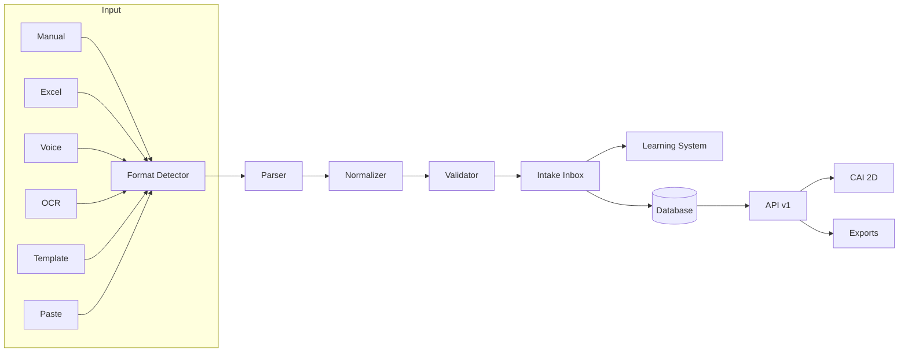

# CAI Intake

<p align="center">
  
</p>

<p align="center">
  <strong>The definitive cutlist data ingestion engine for cabinet & woodworking workshops</strong>
</p>

<p align="center">
  <a href="#features">Features</a> •
  <a href="#quick-start">Quick Start</a> •
  <a href="#architecture">Architecture</a> •
  <a href="#api">API</a> •
  <a href="#documentation">Documentation</a>
</p>

<p align="center">
  
  
  
  
  
</p>

---

## Overview

CAI Intake is an enterprise-grade cutlist ingestion system that transforms messy, inconsistent input data into a clean, canonical format ready for optimization and manufacturing. It's designed to be the "universal translator" for cutlist data in the woodworking industry.

### The Problem

Workshops receive cutlists in countless formats:
- Handwritten notes
- Excel spreadsheets with inconsistent columns
- PDFs from design software
- Verbal instructions
- Photos of paper cutlists

This chaos leads to errors, wasted materials, and frustrated operators.

### The Solution

CAI Intake provides **6 intelligent input modes** that all converge into a single, validated canonical format:

```
┌─────────────────────────────────────────────────────────────┐
│                      INPUT SOURCES                          │
├──────┬──────┬──────┬──────┬──────┬──────┬──────────────────┤
│Manual│Excel │Voice │OCR/AI│QR    │Copy  │     All modes    │
│Entry │Table │Dict. │Upload│Templ.│Paste │     unified      │
└──┬───┴──┬───┴──┬───┴──┬───┴──┬───┴──┬───┘                  │
   │      │      │      │      │      │                       │
   └──────┴──────┴──────┴──────┴──────┘                       │
                      │                                       │
                      ▼                                       │
          ┌───────────────────────┐                           │
          │   CANONICAL SCHEMA    │  ◄── Single source of    │
          │   (cai-cutlist/v1)    │      truth               │
          └───────────┬───────────┘                           │
                      │                                       │
          ┌───────────┴───────────┐                           │
          ▼                       ▼                           │
   ┌─────────────┐       ┌─────────────┐                     │
   │ CAI 2D      │       │ External    │                     │
   │ Optimizer   │       │ Exports     │                     │
   └─────────────┘       └─────────────┘                     │
                                                              │
└─────────────────────────────────────────────────────────────┘
```

## Features

### Input Modes

| Mode | Description | Accuracy |
|------|-------------|----------|
| **Manual Entry** | Fast parse field + full form | 100% |
| **Excel Table** | Paste or upload spreadsheets with column mapping | 95%+ |
| **Voice Dictation** | Speak parts in structured format | 90%+ |
| **File Upload** | PDFs, images, CSVs with AI extraction | 85%+ |
| **QR Templates** | Org-branded forms with guaranteed accuracy | 99%+ |
| **Copy/Paste** | Extract from any text source with smart detection | 85%+ |

### Smart Parsing

- **Auto-Detection**: Automatically detects parser mode based on input format
- **Pattern-Based**: Fast, deterministic parsing for structured data
- **AI-Powered**: Intelligent extraction from unstructured text (Claude + GPT)
- **Multi-Stage OCR**: Text extraction → Python OCR → Claude Native PDF → Vision fallback
- **Learning System**: Improves accuracy through corrections, few-shot learning, and silent training
- **Template Detection**: Auto-detects SketchCut PRO, MaxCut, CutList Plus, and CAI templates
- **Confidence Flagging**: Highlights low-confidence parts for review

### Canonical Schema Features

- **Versioned format** (`cai-cutlist/v1`) for safe evolution
- **L/W convention** with rotation control (allow/lock)
- **Full CNC operations**: edgebanding, grooves, holes, routing
- **Part grouping**: Organize by cabinet, assembly, or custom groups
- **Audit trail**: confidence scores, warnings, human verification
- **Capability tiers**: Simple shops see basic fields, CNC shops see everything

### Enterprise Features

- Multi-tenant organization support
- Role-based access control (Owner, Admin, Manager, Operator, Viewer)
- Versioned REST API with rate limiting
- Webhook notifications for async jobs
- Export to MaxCut, CutList Plus, CutRite, Optimik, and more
- In-app notification system
- Subscription & billing management

## Quick Start

### Prerequisites

- Node.js 20+
- PostgreSQL 15+ (or Supabase)
- npm or yarn

### Installation

```bash
# Clone the repository
git clone https://github.com/positivesocial/CAI-Intake.git
cd CAI-Intake

# Install dependencies
npm install

# Set up environment variables
cp env.example .env
# Edit .env with your database URL and API keys

# Generate Prisma client
npm run db:generate

# Run database migrations
npm run db:push

# Start development server
npm run dev
```

Visit `http://localhost:3000` to see the application.

### Environment Variables

```env
# Database
DATABASE_URL="postgresql://..."
SUPABASE_URL="https://..."
SUPABASE_ANON_KEY="..."
SUPABASE_SERVICE_ROLE_KEY="..."

# AI Providers
OPENAI_API_KEY="sk-..."
ANTHROPIC_API_KEY="sk-ant-..."

# Python OCR Service (optional)
PYTHON_OCR_URL="http://localhost:8000"

# Email (optional)
RESEND_API_KEY="re_..."
EMAIL_FROM="CAI Intake <noreply@cai-intake.io>"
```

### Test Accounts

The application includes demo accounts for testing:

| Role | Email | Password | Access Level |
|------|-------|----------|--------------|
| **Super Admin** | `super@cai-intake.io` | `SuperAdmin123!` | Platform-wide admin |
| **Org Admin** | `admin@acmecabinets.com` | `OrgAdmin123!` | Organization admin |
| **Operator** | `operator@acmecabinets.com` | `Operator123!` | Basic operator |

Use **Quick Demo Login** buttons on the login page for instant access.

## Architecture

### Tech Stack

| Layer | Technology |
|-------|------------|
| Framework | Next.js 16 (App Router, Turbopack) |
| Language | TypeScript 5 |
| Styling | Tailwind CSS + shadcn/ui |
| Database | PostgreSQL + Supabase |
| ORM | Prisma |
| Validation | Zod |
| State | Zustand (persisted) |
| AI | Anthropic Claude (primary), OpenAI GPT (fallback) |
| OCR | Python (Tesseract) + Vision fallback |

### Project Structure

```
src/
├── app/                    # Next.js App Router
│   ├── (auth)/             # Authentication routes
│   ├── (dashboard)/        # Protected dashboard
│   │   ├── cutlists/       # Cutlist management
│   │   ├── intake/         # Intake workflow
│   │   ├── help/           # Help center
│   │   └── settings/       # Organization settings
│   ├── (marketing)/        # Public pages
│   ├── (platform)/         # Super admin pages
│   └── api/v1/             # Versioned API
├── components/
│   ├── ui/                 # shadcn components
│   ├── intake/             # Intake-specific components
│   ├── parts/              # Parts table components
│   └── training/           # Learning system UI
├── lib/
│   ├── schema/             # Canonical Zod schemas
│   ├── parsers/            # Input parsing engines
│   ├── parser/             # Format detection
│   ├── ai/                 # AI provider clients
│   ├── learning/           # Learning system
│   ├── exports/            # Export format generators
│   ├── notifications/      # Notification system
│   └── subscriptions/      # Billing integration
└── types/                  # TypeScript types
```

### Data Flow



## API

### Base URL

```
https://api.cai-intake.io/v1
```

### Authentication

```bash
curl -H "Authorization: Bearer $API_KEY" ...
```

### Endpoints

| Endpoint | Method | Description |
|----------|--------|-------------|
| `/cutlists` | POST | Create a cutlist |
| `/cutlists/{id}` | GET | Get a cutlist |
| `/cutlists/{id}` | PATCH | Update a cutlist |
| `/parse-file` | POST | Parse a file with AI/OCR |
| `/parse-text` | POST | Parse text input |
| `/exports` | POST | Create an export |
| `/subscription` | GET | Get subscription details |
| `/billing/checkout` | POST | Create checkout session |

### Example: Parse Text

```bash
curl -X POST https://api.cai-intake.io/v1/parse-text \
  -H "Authorization: Bearer $API_KEY" \
  -H "Content-Type: application/json" \
  -d '{
    "text": "Side panel 720x560 qty 2 white board edge 2L",
    "options": {
      "units": "mm",
      "default_thickness_mm": 18
    }
  }'
```

## Documentation

- **User Guide**: [docs/USER_GUIDE.md](docs/USER_GUIDE.md)
- **API Reference**: [docs/API.md](docs/API.md)
- **Deployment Guide**: [docs/DEPLOYMENT.md](docs/DEPLOYMENT.md)
- **Learning System**: [docs/LEARNING_SYSTEM.md](docs/LEARNING_SYSTEM.md)

## Development

### Commands

```bash
npm run dev          # Start development server (Turbopack)
npm run build        # Build for production
npm run lint         # Run ESLint
npm run db:generate  # Generate Prisma client
npm run db:push      # Push schema to database
npm run db:migrate   # Run migrations
npm run db:studio    # Open Prisma Studio
```

### Git Workflow

```
main (production)
  └── develop (integration)
        ├── feature/schema-core
        ├── feature/manual-entry
        └── feature/excel-import
```

- **Conventional Commits**: `feat:`, `fix:`, `docs:`, `chore:`
- **PR required** for all changes to `develop` and `main`
- **CI runs** on every push and PR

## Roadmap

- [x] Phase 1: Foundation (Schema + Manual Entry)
- [x] Phase 2: Excel/CSV Import with Mapping Wizard
- [x] Phase 3: Voice Dictation Mode
- [x] Phase 4: OCR + AI Parsing (multi-stage fallback)
- [x] Phase 5: QR Template System
- [x] Phase 6: Export Formats (MaxCut, CutList Plus, CutRite, Optimik)
- [x] Phase 7: Subscription & Billing System
- [x] Phase 8: Super Admin Platform
- [x] Phase 9: Learning System (few-shot, corrections, patterns)
- [x] Phase 10: Notification System
- [x] Phase 11: Claude Native PDF Support
- [x] Phase 12: Silent Auto-Training from Corrections
- [x] Phase 13: Template-Aware Few-Shot Selection
- [x] Phase 14: Confidence-Based Flagging
- [ ] Phase 15: CAI 2D Optimizer Integration
- [ ] Phase 16: Mobile App

## Export Formats

| Format | Extension | Description |
|--------|-----------|-------------|
| **JSON** | `.json` | Native CAI format with full metadata |
| **CSV** | `.csv` | Universal spreadsheet format |
| **PDF** | `.pdf` | Printable parts list |
| **MaxCut** | `.mcp` | MaxCut optimization software |
| **CutList Plus** | `.csv` | CutList Plus Pro format |
| **CutRite** | `.xml` | CutRite/Holzma format |
| **Optimik** | `.csv` | Optimik software format |

## Subscription Plans

| Plan | Price | Team | Cutlists | Features |
|------|-------|------|----------|----------|
| **Free** | $0/mo | 1 user | 5/month | Basic entry, CSV export |
| **Starter** | $29/mo | 3 users | 50/month | Excel, Voice, Edgebanding |
| **Professional** | $79/mo | 10 users | 500/month | Full OCR, CNC ops, API |
| **Enterprise** | Custom | Unlimited | Unlimited | Priority support, SLA |

## Contributing

1. Fork the repository
2. Create a feature branch (`git checkout -b feature/amazing-feature`)
3. Commit your changes (`git commit -m 'feat: add amazing feature'`)
4. Push to the branch (`git push origin feature/amazing-feature`)
5. Open a Pull Request

## License

Proprietary - All Rights Reserved. See [LICENSE](LICENSE) for details.

---

<p align="center">
  Built with ❤️ by <a href="https://github.com/positivesocial">PositiveSocial</a>
</p>

<p align="center">
  Part of the <strong>CabinetAI</strong> ecosystem
</p>
