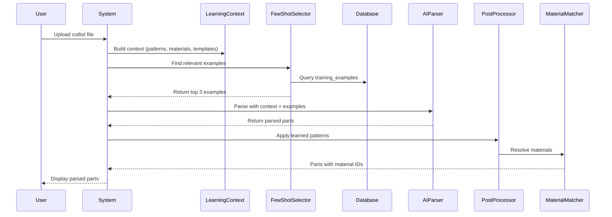
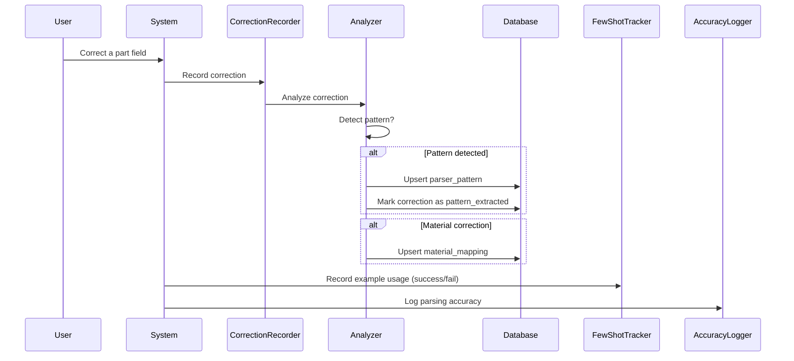

# CAI Intake Learning System Documentation

<p align="center">
  <strong>AI Learning System Technical Reference v2.0</strong><br>
  <em>Last Updated: January 2025</em>
</p>

---

## Executive Summary

The CAI Intake Learning System is an adaptive parsing engine that improves its accuracy over time by learning from user corrections, training examples, and parsing outcomes. It uses a combination of **few-shot learning**, **pattern recognition**, **material mapping**, and **client template detection** to provide increasingly accurate cutlist parsing.

---

## Table of Contents

1. [Architecture Overview](#architecture-overview)
2. [Core Learning Components](#core-learning-components)
3. [How Learning Works in Normal Use](#how-learning-works-in-normal-use)
4. [Superadmin Training Mode](#superadmin-training-mode)
5. [Database Schema](#database-schema)
6. [API Endpoints](#api-endpoints)
7. [Current Implementation Status](#current-implementation-status)
8. [Known Gaps & Missing Features](#known-gaps--missing-features)
9. [Improvement Roadmap](#improvement-roadmap)
10. [Making This Cutting Edge](#making-this-cutting-edge)

---

## Architecture Overview

```
┌─────────────────────────────────────────────────────────────────────┐
│                         USER INPUT                                   │
│              (PDF, Image, Excel, Pasted Text, Voice)                 │
└─────────────────────────────────┬───────────────────────────────────┘
                                  │
                                  ▼
┌─────────────────────────────────────────────────────────────────────┐
│                    LEARNING CONTEXT BUILDER                          │
│  ┌──────────────────┐ ┌──────────────────┐ ┌──────────────────┐     │
│  │ Material Mappings │ │ Parser Patterns  │ │ Client Templates │     │
│  │  (org + global)  │ │  (org + global)  │ │  (auto-detected) │     │
│  └──────────────────┘ └──────────────────┘ └──────────────────┘     │
└─────────────────────────────────┬───────────────────────────────────┘
                                  │
                                  ▼
┌─────────────────────────────────────────────────────────────────────┐
│                    FEW-SHOT EXAMPLE SELECTOR                         │
│  - Matches input features (headers, columns, edge/groove patterns)   │
│  - Scores by: success rate, text similarity, client match            │
│  - Selects top 3 most relevant examples                              │
└─────────────────────────────────┬───────────────────────────────────┘
                                  │
                                  ▼
┌─────────────────────────────────────────────────────────────────────┐
│                      AI PARSER (Claude/GPT)                          │
│  - Base system prompt + learned patterns                             │
│  - Few-shot examples prepended to prompt                             │
│  - Material mappings for ID resolution                               │
│  - Client template column ordering                                   │
└─────────────────────────────────┬───────────────────────────────────┘
                                  │
                                  ▼
┌─────────────────────────────────────────────────────────────────────┐
│                      POST-PROCESSING                                 │
│  - Apply learned patterns (edge notation, quantity formats)          │
│  - Match materials to org's material library                         │
│  - Resolve operations to org's operation codes                       │
└─────────────────────────────────┬───────────────────────────────────┘
                                  │
                                  ▼
┌─────────────────────────────────────────────────────────────────────┐
│                      USER REVIEW & CORRECTION                        │
│  - User verifies/corrects parsed parts                               │
│  - Corrections are detected and recorded                             │
│  - Patterns extracted and learned automatically                      │
└─────────────────────────────────┬───────────────────────────────────┘
                                  │
                                  ▼
┌─────────────────────────────────────────────────────────────────────┐
│                      LEARNING FEEDBACK LOOP                          │
│  - Record correction → Analyze pattern → Auto-learn if confident     │
│  - Update success/usage counts on few-shot examples                  │
│  - Log accuracy metrics for analytics                                │
└─────────────────────────────────────────────────────────────────────┘
```

---

## Core Learning Components

### 1. Few-Shot Learning (`src/lib/learning/few-shot.ts`)

The few-shot learning module provides example-based learning for the AI parser.

**Key Features:**
- **Training Examples**: Curated input→output pairs stored in database
- **Smart Selection**: Selects the most relevant examples based on:
  - Text structure similarity (headers, column count, row count)
  - Feature matching (edge notation, groove notation, drilling, CNC)
  - Success rate history
  - Client/category matching
  - **Template matching** (NEW)
- **Usage Tracking**: Records whether examples led to successful parses

**Selection Algorithm:**
```typescript
// Score calculation (0-100 points)
score = 0;
score += successRate * 30;           // Past success (0-30)
score += min(usageCount/10, 1) * 10; // Reliability (0-10)
score += structureSimilarity;         // Headers, columns (0-20)
score += featureMatching;             // Edge/groove patterns (0-20)
score += clientMatch * 15;            // Client name match (0-15)
score += categoryMatch * 5;           // Category match (0-5)
score += exactTemplateMatch * 40;     // Exact template match (0-40) NEW
score += partialTemplateMatch * 25;   // Partial template match (0-25) NEW
```

**Template Detection (NEW):**
The system detects known templates from text and filenames:
- **SketchCut PRO**: Underline patterns, "gl/GL" notation
- **MaxCut**: L-L-W-W binary format, "actual size"
- **CutList Plus**: Standard headers, column patterns
- **CAI Template**: QR code format
- **Handwritten**: "handwritten", "fundi" keywords

### 2. Correction Recording & Silent Auto-Training

#### Correction Recording (`src/lib/learning/corrections.ts`)

Captures user corrections and extracts learnable patterns.

**Correction Types:**
| Type | Description | Auto-Learn |
|------|-------------|------------|
| `dimension` | L/W/T changes | ❌ (complex) |
| `quantity` | Qty corrections | ✅ |
| `material` | Material ID changes | ✅ |
| `label` | Part name changes | ❌ |
| `edge_banding` | Edge notation changes | ✅ |
| `groove` | Groove notation changes | ✅ |
| `rotation` | Allow rotation changes | ❌ |

#### Silent Auto-Training (`src/components/training/AutoTrainingPrompt.tsx`)

**NEW:** User corrections are automatically saved as training examples in the background, without user prompts:

1. User makes corrections in the Parts Inbox
2. System detects significant corrections (score >= 15 points)
3. After 5 seconds of inactivity, corrections are silently saved
4. Training examples are created with medium difficulty
5. No user interaction required

**Significance Scoring:**
- Dimension change: +10 points
- Material change: +8 points
- Edge/groove change: +6 points each
- Quantity change: +4 points
- Multiple corrections multiplied

**Benefits:**
- Zero friction for users
- Continuous improvement without manual training
- Every correction improves future parsing

### 3. Pattern Learning (`src/lib/learning/patterns.ts`)

Stores and applies learned parsing patterns.

**Pattern Types:**
| Type | Example Input | Example Output |
|------|---------------|----------------|
| `edge_notation` | "X" | `{ edges: ["L1"] }` |
| `edge_notation` | "4L" | `{ edges: ["L1", "L2", "W1", "W2"] }` |
| `groove_notation` | "x" (lowercase) | `{ groove: "W2" }` |
| `dimension_format` | "(\d+)x(\d+)" | `{ order: "LxW" }` |
| `quantity_format` | "x(\d+)" | `{ prefix: "x" }` |

**Default Patterns (Fallback):**
- X → L1, XX → W1+W2, 4L → all edges, 2L → L1+L2, 2W → W1+W2
- lowercase x → groove on W2
- "x5" → quantity 5, "5 pcs" → quantity 5

### 4. Material Mapping (`src/lib/learning/materials.ts`)

Maps raw material names to standardized material IDs.

**Features:**
- Normalized name matching (lowercase, no special chars)
- Fuzzy matching for partial matches
- Thickness inference from name (e.g., "18mm white melamine")
- Confidence-based ranking
- Usage tracking with confidence growth

**Material Inference:**
```typescript
// Examples of inferred materials
"white melamine 18mm" → MAT-WHITE-18
"pb black cherry" → MAT-PB-CHERRY-18
"mdf" → MAT-MDF-18
"plywood" → MAT-PLY-18
```

### 5. Client Templates (`src/lib/learning/templates.ts`)

Stores client-specific parsing configurations.

**Template Contents:**
- Column order (e.g., ["label", "length", "width", "qty", "edge"])
- Edge notation mappings (client-specific)
- Groove notation mappings
- Default material and thickness
- Header patterns for auto-detection
- Client aliases for matching

**Auto-Detection:**
```typescript
// Template is detected by:
1. Header pattern matching (regex against first row)
2. Client name in document
3. Client alias matching
```

### 6. Accuracy Tracking (`src/lib/learning/accuracy.ts`)

Tracks and analyzes parsing accuracy over time.

**Metrics Tracked:**
- Overall accuracy
- Per-field accuracy (dimensions, materials, edges, grooves, quantities, labels)
- Provider comparison (Claude vs GPT)
- Trend analysis (improving/stable/declining)
- Weak area identification

**Accuracy Calculation:**
```typescript
// A part is "correct" if:
accuracy = correctParts / totalParts;

// Field accuracy is calculated independently:
dimensionAccuracy = dimensionCorrect / totalMatched;
materialAccuracy = materialCorrect / totalMatched;
// ... etc
```

### 7. Confidence Flagging (`src/components/training/ConfidenceFlag.tsx`) - NEW

Visual indicators for parsing confidence, helping users identify parts that need review.

**Confidence Levels:**
| Level | Color | Threshold | Meaning |
|-------|-------|-----------|---------|
| High | Green | ≥0.85 | All fields parsed confidently |
| Medium | Yellow | 0.6-0.84 | Some fields may need verification |
| Low | Red | <0.6 | Review recommended |

**Features:**
- Per-part confidence badges
- Field-by-field breakdown on hover
- Low-confidence parts summary banner
- Quick "Correct" / "Fix Needed" feedback buttons

**Confidence Factors:**
- Dimension parsing clarity
- Material match confidence
- Edge/groove notation recognition
- Label extraction quality
- Source text structure

---

## How Learning Works in Normal Use

### During Parsing



### During Correction



### Implicit Learning (Every Parse)

1. **Example Usage Recording**: When few-shot examples are used, their usage and success counts are updated
2. **Pattern Application Tracking**: When patterns are applied, their success is recorded
3. **Material Mapping Usage**: Material mappings gain confidence with successful use
4. **Client Template Learning**: Templates gain confidence and success rate over time

---

## Superadmin Training Mode

### Access Control
- Only users with `isSuperAdmin = true` can access training features
- Training affects the entire platform (global examples)

### Training Dashboard (`/settings/training`)

**Features:**
1. **Accuracy Overview**
   - Overall accuracy percentage
   - Field-by-field breakdown
   - Trend analysis (improving/stable/declining)
   - Few-shot effectiveness comparison

2. **Training Examples Management**
   - View all examples (global + organization)
   - Add new examples manually
   - Bulk upload from files
   - View usage statistics per example

3. **Weak Areas Identification**
   - Automatic detection of low-accuracy fields
   - Suggestions for improvement
   - Priority ranking

### Adding Training Examples

**Manual Entry:**
```typescript
// Required fields
{
  sourceType: "pdf" | "image" | "text" | "csv",
  sourceText: string,        // The raw input text
  correctParts: CutPart[],   // Ground truth parts
  // Optional
  sourceFileName: string,
  correctMetadata: { jobName, clientName, defaultMaterial },
  category: string,
  difficulty: "easy" | "medium" | "hard",
  clientName: string,
}
```

**Bulk Upload:**
1. Upload a file (PDF, image, or text)
2. System parses it
3. Admin corrects any errors
4. Corrected result becomes a training example

### Test Parse Feature

Allows testing parser against current training data:
1. Paste sample text
2. System parses with current examples
3. View which examples were selected
4. See parsed output
5. Compare with expected output

---

## Database Schema

### `training_examples`
```sql
CREATE TABLE training_examples (
  id UUID PRIMARY KEY,
  organization_id UUID REFERENCES organizations(id),
  source_type TEXT NOT NULL,
  source_text TEXT NOT NULL,
  source_file_name TEXT,
  source_file_hash TEXT UNIQUE,
  correct_parts JSONB NOT NULL,
  correct_metadata JSONB,
  category TEXT,
  difficulty TEXT DEFAULT 'medium',
  client_name TEXT,
  has_headers BOOLEAN,
  column_count INTEGER,
  row_count INTEGER,
  has_edge_notation BOOLEAN,
  has_groove_notation BOOLEAN,
  usage_count INTEGER DEFAULT 0,
  success_count INTEGER DEFAULT 0,
  last_used_at TIMESTAMPTZ,
  is_active BOOLEAN DEFAULT true,
  created_by_id UUID,
  created_at TIMESTAMPTZ DEFAULT NOW()
);
```

### `parse_corrections`
```sql
CREATE TABLE parse_corrections (
  id UUID PRIMARY KEY,
  organization_id UUID,
  user_id UUID,
  parse_job_id UUID,
  cutlist_id UUID,
  correction_type TEXT NOT NULL,
  field_path TEXT,
  original_value JSONB,
  corrected_value JSONB,
  original_part JSONB,
  corrected_part JSONB,
  source_text TEXT,
  source_line_number INTEGER,
  source_file_name TEXT,
  pattern_extracted BOOLEAN DEFAULT false,
  pattern_id UUID,
  created_at TIMESTAMPTZ DEFAULT NOW()
);
```

### `parser_patterns`
```sql
CREATE TABLE parser_patterns (
  id UUID PRIMARY KEY,
  organization_id UUID,
  pattern_type TEXT NOT NULL,
  input_pattern TEXT NOT NULL,
  output_mapping JSONB NOT NULL,
  description TEXT,
  confidence DECIMAL DEFAULT 0.5,
  usage_count INTEGER DEFAULT 0,
  success_count INTEGER DEFAULT 0,
  last_used_at TIMESTAMPTZ,
  created_at TIMESTAMPTZ DEFAULT NOW(),
  UNIQUE(organization_id, pattern_type, input_pattern)
);
```

### `material_mappings`
```sql
CREATE TABLE material_mappings (
  id UUID PRIMARY KEY,
  organization_id UUID,
  raw_name TEXT NOT NULL,
  normalized_name TEXT NOT NULL,
  material_id TEXT NOT NULL,
  thickness_mm INTEGER,
  confidence DECIMAL DEFAULT 0.5,
  usage_count INTEGER DEFAULT 0,
  last_used_at TIMESTAMPTZ,
  UNIQUE(organization_id, normalized_name)
);
```

### `client_templates`
```sql
CREATE TABLE client_templates (
  id UUID PRIMARY KEY,
  organization_id UUID,
  client_name TEXT NOT NULL,
  client_aliases TEXT[],
  column_order TEXT[],
  edge_notation JSONB,
  groove_notation JSONB,
  default_material_id TEXT,
  default_thickness_mm INTEGER,
  header_patterns TEXT[],
  sample_rows JSONB,
  notes TEXT,
  confidence DECIMAL DEFAULT 0.5,
  usage_count INTEGER DEFAULT 0,
  success_rate DECIMAL DEFAULT 0.5,
  last_used_at TIMESTAMPTZ,
  UNIQUE(organization_id, client_name)
);
```

### `parsing_accuracy_logs`
```sql
CREATE TABLE parsing_accuracy_logs (
  id UUID PRIMARY KEY,
  organization_id UUID,
  parse_job_id UUID,
  provider TEXT,
  source_type TEXT,
  total_parts INTEGER,
  correct_parts INTEGER,
  accuracy DECIMAL,
  dimension_accuracy DECIMAL,
  material_accuracy DECIMAL,
  edging_accuracy DECIMAL,
  grooving_accuracy DECIMAL,
  quantity_accuracy DECIMAL,
  label_accuracy DECIMAL,
  few_shot_examples_used INTEGER,
  patterns_applied INTEGER,
  client_template_used BOOLEAN,
  document_difficulty TEXT,
  client_name TEXT,
  created_at TIMESTAMPTZ DEFAULT NOW()
);
```

---

## API Endpoints

### Training Examples
| Method | Endpoint | Access | Description |
|--------|----------|--------|-------------|
| `GET` | `/api/v1/training/examples` | Superadmin | List all examples |
| `POST` | `/api/v1/training/examples` | Superadmin | Create new example |
| `GET` | `/api/v1/training/examples/:id` | Superadmin | Get example details |
| `PUT` | `/api/v1/training/examples/:id` | Superadmin | Update example |
| `DELETE` | `/api/v1/training/examples/:id` | Superadmin | Deactivate example |

### Accuracy Metrics
| Method | Endpoint | Access | Description |
|--------|----------|--------|-------------|
| `GET` | `/api/v1/training/accuracy` | Superadmin | Get accuracy summary |
| `GET` | `/api/v1/training/accuracy/trends` | Superadmin | Get accuracy trends |
| `GET` | `/api/v1/training/accuracy/weak-areas` | Superadmin | Get weak areas |

### Test Parse
| Method | Endpoint | Access | Description |
|--------|----------|--------|-------------|
| `POST` | `/api/v1/training/test-parse` | Superadmin | Test parser |

### Bulk Upload
| Method | Endpoint | Access | Description |
|--------|----------|--------|-------------|
| `POST` | `/api/v1/training/bulk-upload` | Superadmin | Upload training files |

---

## Current Implementation Status

### ✅ Fully Implemented
- Few-shot example selection and formatting
- Training example CRUD operations
- Correction recording and analysis
- Pattern detection and storage
- Material mapping with fuzzy matching
- Client template detection and application
- Accuracy logging and analytics
- Superadmin training dashboard
- Bulk training upload
- **Silent auto-training from corrections** (NEW)
- **Template-aware few-shot selection** (NEW)
- **Confidence-based flagging** (NEW)
- Template detection (SketchCut PRO, MaxCut, CutList Plus, CAI Templates)

### ⚠️ Partially Implemented
- Client template auto-creation from corrections
- Dimension format learning
- Column order learning

### ❌ Not Yet Implemented
- Active learning (uncertainty-based example selection)
- Reinforcement learning from user feedback
- Cross-organization knowledge transfer
- Embedding-based similarity search
- A/B testing for pattern effectiveness

---

## Known Gaps & Missing Features

### 1. Learning Effectiveness

| Gap | Impact | Priority |
|-----|--------|----------|
| No embedding-based similarity | Less relevant few-shot examples | High |
| Limited pattern types | Can't learn complex formats | Medium |
| No negative examples | Can't learn what NOT to do | Medium |
| No confidence calibration | Over/under-confident patterns | Low |

### 2. User Experience

| Gap | Impact | Priority |
|-----|--------|----------|
| No correction UI integration | Users can't easily correct | High |
| No learning feedback to user | Users don't see impact | Medium |
| No training progress dashboard | Admins can't track improvement | Medium |

### 3. Technical Limitations

| Gap | Impact | Priority |
|-----|--------|----------|
| Patterns are regex-based | Limited flexibility | Medium |
| No versioning of patterns | Can't rollback bad patterns | Low |
| No A/B testing | Can't measure pattern effectiveness | Low |

### 4. Data Quality

| Gap | Impact | Priority |
|-----|--------|----------|
| No training example validation | Bad examples degrade quality | High |
| No duplicate detection for patterns | Redundant patterns | Medium |
| No periodic retraining | Stale patterns | Low |

---

## Improvement Roadmap

### Phase 1: Foundation Fixes (Current Sprint)

1. **Integrate Correction UI**
   - Add correction tracking to parts editor
   - Show original vs corrected values
   - One-click correction recording

2. **Improve Pattern Detection**
   - Support more edge notation variants
   - Learn groove dimension patterns
   - Detect quantity placement patterns

3. **Accuracy Dashboard Fixes**
   - Real-time accuracy updates
   - Per-client accuracy breakdown
   - Export accuracy reports

### Phase 2: Smart Learning (Next Quarter)

1. **Embedding-Based Similarity**
   - Generate embeddings for training examples
   - Use vector similarity for example selection
   - Fall back to feature-based if embeddings unavailable

2. **Active Learning**
   - Identify uncertain parses
   - Request user verification on uncertain parts
   - Prioritize examples that fill knowledge gaps

3. **Contextual Pattern Learning**
   - Learn patterns per document type
   - Learn patterns per client
   - Support conditional patterns

### Phase 3: Advanced Features (Future)

1. **Cross-Organization Learning**
   - Anonymized pattern sharing
   - Industry-standard pattern library
   - Opt-in knowledge contribution

2. **Reinforcement Learning**
   - Track user acceptance rate
   - Penalize rejected suggestions
   - Reward accepted suggestions

3. **Automatic Training**
   - Generate synthetic training data
   - Auto-curate from successful parses
   - Periodic model fine-tuning

---

## Making This Cutting Edge

### 1. Vector Similarity Search

Replace feature-based example matching with embedding-based search:

```typescript
// Current (feature-based)
score = structureSimilarity + clientMatch + successRate;

// Proposed (embedding-based)
const inputEmbedding = await generateEmbedding(inputText);
const candidates = await vectorSearch(inputEmbedding, limit: 10);
const reranked = rerank(candidates, { clientHint, categoryHint });
```

**Implementation:**
- Use OpenAI embeddings API (text-embedding-3-small)
- Store embeddings in Supabase with pgvector
- Hybrid search: vector + keyword filters

### 2. Uncertainty-Based Active Learning

Request verification only when AI is uncertain:

```typescript
interface PartWithUncertainty {
  part: CutPart;
  uncertainFields: Array<{
    field: string;
    confidence: number;
    alternatives: Array<{ value: unknown; confidence: number }>;
  }>;
}

// UI shows uncertain fields for user verification
if (part.uncertainFields.length > 0) {
  showVerificationRequest(part);
}
```

### 3. Real-Time Learning

Learn immediately from corrections without waiting for next parse:

```typescript
// On correction
onCorrection(field, original, corrected) {
  // 1. Record correction
  recordCorrection({ field, original, corrected });
  
  // 2. Immediately update pattern cache
  patternCache.invalidate(field);
  
  // 3. Notify other active sessions
  realtimeChannel.broadcast({ type: 'pattern_updated', field });
}
```

### 4. Multi-Modal Learning

Learn from corrections across all input types:

```typescript
// Unified correction interface
interface MultiModalCorrection {
  sourceType: 'text' | 'image' | 'pdf' | 'voice';
  sourceRegion?: { x, y, width, height }; // For images
  sourcePage?: number; // For PDFs
  sourceTimestamp?: number; // For voice
  correction: Correction;
}
```

### 5. Federated Learning

Learn from all organizations while preserving privacy:

```typescript
// Anonymized pattern sharing
interface SharedPattern {
  patternType: string;
  inputPattern: string;
  outputMapping: object;
  aggregatedConfidence: number; // From multiple orgs
  usageCount: number; // Total across orgs
}

// Organization contribution
contributePattern(pattern) {
  // Remove org-specific identifiers
  const anonymized = anonymize(pattern);
  // Share with central repository
  await centralRepo.contribute(anonymized);
}
```

### 6. Explainable AI

Show users why the AI made its decisions:

```typescript
interface ParseExplanation {
  part: CutPart;
  reasoning: Array<{
    field: string;
    decision: string;
    confidence: number;
    sources: Array<{
      type: 'few_shot' | 'pattern' | 'template' | 'inference';
      reference: string;
    }>;
  }>;
}

// Example
{
  field: "material_id",
  decision: "MAT-WHITE-18",
  confidence: 0.92,
  sources: [
    { type: "few_shot", reference: "Example #42 had similar text" },
    { type: "pattern", reference: "Pattern: 'white mel' → MAT-WHITE-18" }
  ]
}
```

### 7. Continuous Model Improvement

Regular automated retraining:

```typescript
// Weekly retraining job
async function weeklyRetraining() {
  // 1. Collect successful parses from last week
  const successfulParses = await getSuccessfulParses({ days: 7 });
  
  // 2. Filter high-confidence corrections
  const qualityExamples = filterByConfidence(successfulParses, threshold: 0.95);
  
  // 3. Add to training set
  await addTrainingExamples(qualityExamples);
  
  // 4. Prune low-performing examples
  await pruneExamples({ minSuccessRate: 0.5, minUsage: 5 });
  
  // 5. Regenerate embeddings
  await regenerateEmbeddings();
}
```

---

## Conclusion

The CAI Intake Learning System provides a solid foundation for adaptive parsing. The current implementation covers the essential learning mechanisms (few-shot examples, pattern learning, material mapping, client templates), but significant opportunities exist to make it truly cutting-edge:

1. **Short-term**: Integrate correction UI, fix accuracy dashboard
2. **Medium-term**: Add embedding-based similarity, active learning
3. **Long-term**: Federated learning, continuous improvement, explainable AI

The key to success is **closing the feedback loop** - making it easy for users to correct errors and ensuring those corrections immediately improve future parsing.

